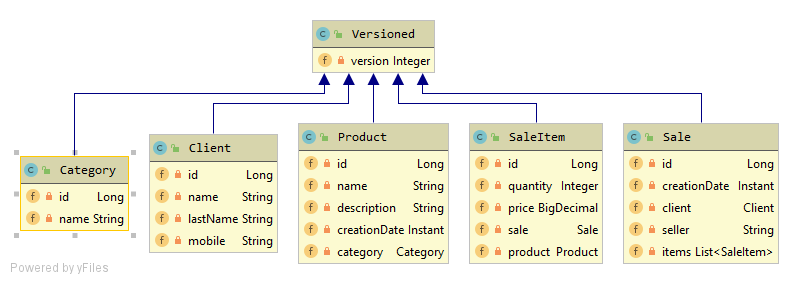
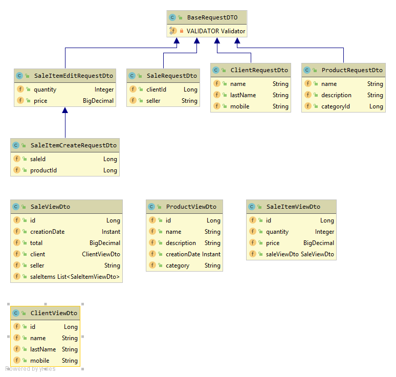
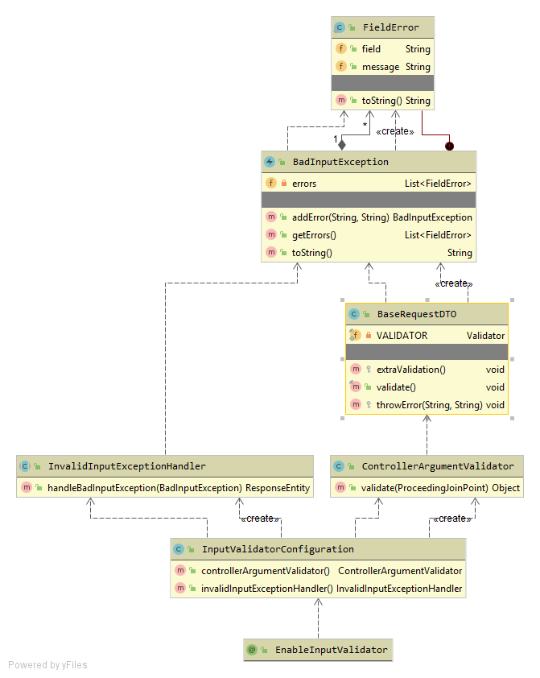

# Spring Boot Quiz!

this repository is a Spring boot  Api which represent a simple sale system. 

## Main Modules
there are three main modules in the system:
 1. Products Module : 	
	which allows the user to deal with products, so he can view, create and update the products. 
 2. Clients Module:
	which allows the user to deal with clients so he can view, create and update the Clients.
 3.  Sales Module:
	which allows the user to view, create, update the sale and to add sale items to the sale, or update the existing one.

 

## Validation 

the system uses a **@EnableInputValidator** which enables validations on every request contains a dto as the body and throws an exception of type **BadInputException** in case that the object does not meet the validation annotations on its attributes.
notice that the dto must extend **BaseRequestDTO**.

 

## Exceptions 
there are two types of exceptions defined in the system:
1- **BadInputException** which is thrown when the request body 
does not meet the validations, and it has an array of violations.

2- **ManagedException** is an RunTimeException, contains an Enum **CmsError** represents the  **HttpCode** according with the error.  

## Exception Handling
there are two exception hadlers:
1- the first is **InvalidInputExceptionHandler** which is on demand exception handler (activated if **@EnableInputValidator** ).
**InvalidInputExceptionHandler** is handling  **BadInputException** and return response of bad request. 

2- the second is **GlobalExceptionHandler** which handles  **ManagedException** and any other exception.

## Testing
the system uses `juint`  to test the APIs
you can run the test as 

    mvn test
   

## UML diagrams

Class Diagram that represents the cms controllers, services and repositories:

Class Diagram that represents the Entities

Class Diagram that represents the Dtos

Class Diagram that represents the InputValidation mechanism

